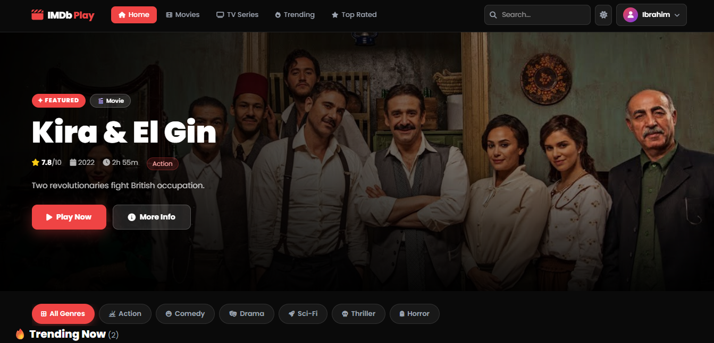
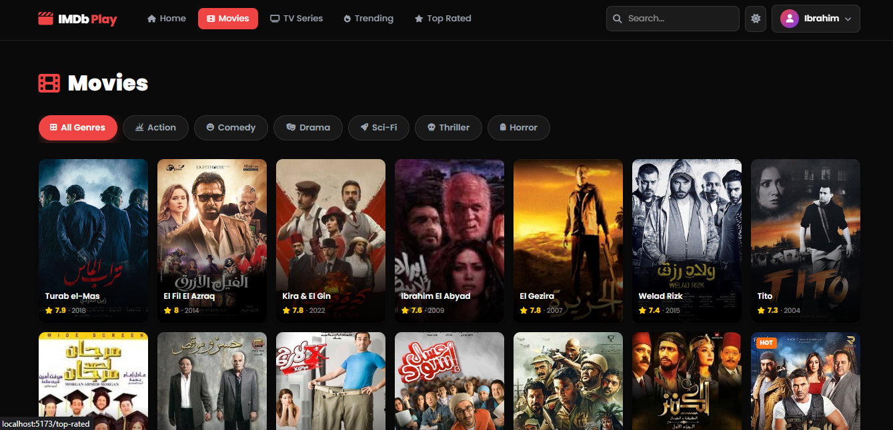
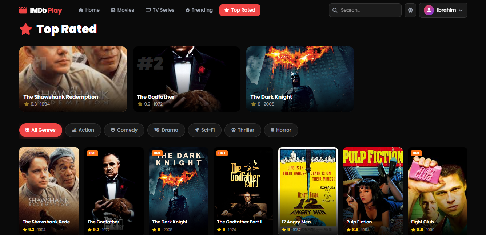

# 🎬 IMDb Play — Streaming Platform

A full-stack movie & TV series streaming platform built with React 18, Laravel 12, MySQL, and Laravel Sanctum.

> 📸 Project Preview  
> 
> 
> 

---

---

## 📖 Table of Contents

- [✨ Features](#-features)
- [🛠️ Tech Stack](#️-tech-stack)
- [🛡️ Security](#️-security)
- [🤝 Contributing](#-contributing)
- [📜 License](#-license)

---

## ✨ Features

- **🎬 Movies & TV Series** — Browse, search, and filter content by genre with a Netflix-style UI.
- **🔥 Trending & Top Rated** — Dedicated pages for HOT, NEW, and highest-rated titles.
- **🎭 Featured Hero Section** — Admin-controlled hero banner on the home page.
- **📺 Seasons & Episodes** — Full season/episode management for TV series with detail pages.
- **🎯 Genre Filtering** — Filter by Action, Comedy, Drama, Sci-Fi, Thriller, or Horror.
- **🔍 Live Search** — Instant search with suggestions dropdown in the header.
- **❤️ My List & Favorites** — Save content to personal lists, synced to account in real time.
- **👤 Director & Cast Pages** — Auto-generated pages for every director and actor.
- **🌓 Dark / Light Mode** — Full theme toggle persisted across sessions.
- **👤 User Dashboard** — View profile, My List, Favorites, and change account settings.
- **🛡️ Admin Dashboard** — Full control panel: add/edit/delete content, manage users, set featured.
- **📱 Responsive Design** — Works seamlessly on mobile, tablet, and desktop.
- **🌐 REST API** — Clean, versioned API with consistent JSON responses.
- **🔒 Role-Based Access** — User and Admin roles with protected routes on both frontend and backend.
- **🚫 CSRF-Free** — Stateless Bearer Token auth via Vite proxy — zero CORS or CSRF conflicts.

---

## 🛠️ Tech Stack

| Layer         | Technology                              |
|---------------|-----------------------------------------|
| Frontend      | React 18, TypeScript, React Router v7   |
| Styling       | Tailwind CSS v4 + CSS Variables         |
| State         | Context API (Auth, Content, Theme)      |
| HTTP Client   | Axios + Vite Dev Proxy                  |
| Backend       | Laravel 12 (PHP 8.2+)                  |
| Auth          | Laravel Sanctum (Bearer Token)          |
| Database      | MySQL 8.0                               |
| Build Tool    | Vite 6                                  |
| Icons         | Font Awesome 6                          |
| Font          | Poppins (Google Fonts)                  |

---

## 📦 Prerequisites

| Tool       | Version   |
|------------|-----------|
| PHP        | >= 8.2    |
| Composer   | >= 2.x    |
| MySQL      | >= 8.0    |
| Node.js    | >= 18.x   |
| npm        | >= 9.x    |

---

## 🛡️ Security

| Concern               | Implementation                                       |
|-----------------------|------------------------------------------------------|
| Authentication        | Laravel Sanctum — stateless Bearer Token             |
| CSRF                  | None needed — token auth, not cookie-based           |
| CORS                  | Vite proxy in dev; CORS config for production        |
| Role protection       | `AdminMiddleware` checks `role === admin`            |
| Password storage      | bcrypt via Laravel's built-in hashing                |
| SQL injection         | Eloquent ORM with parameterized queries              |
| XSS                   | React JSX auto-escaping                              |
| Input validation      | Laravel `Validator` on every endpoint                |
| Soft deletes          | Content is soft-deleted, not permanently removed     |

---

## 🤝 Contributing

We welcome contributions! Please see our [Contributing.md](./Contributing.md) for more details on how to get started.

---

## 📜 License

This project is licensed under the MIT License. See the [LICENSE](./LICENSE.md) file for details.

---

Built with ❤️ by **Ibrahim Elsayed** — [@iibrahimjrr](https://github.com/iibrahimjrr)